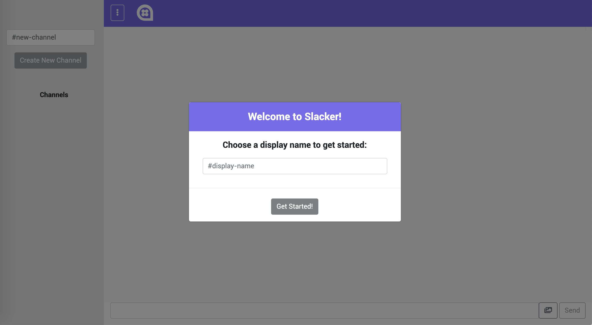
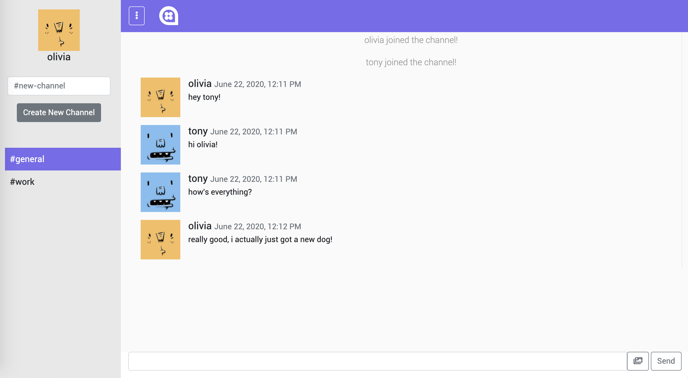
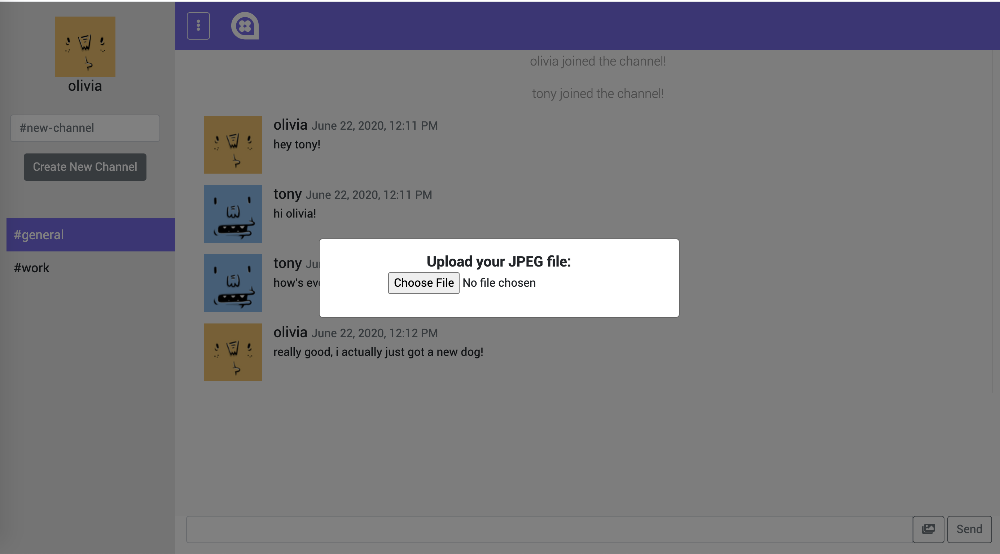
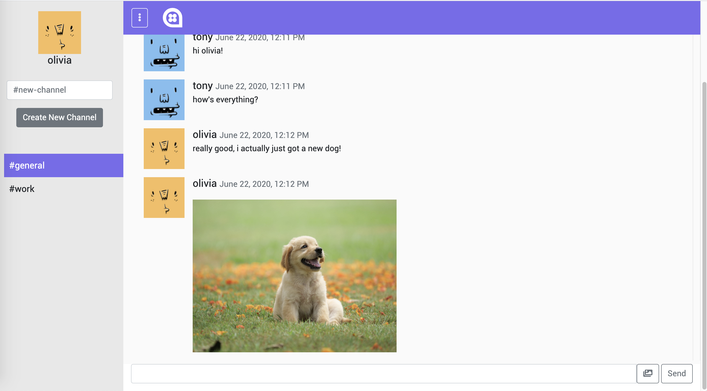

# Slacker

Slacker is a single page, slack-like chat application, where users can chat in public channels. The collapsible side navigation bar allows a user to either create a new channel or select an existing channel to join. Once a user joins a channel, the newly joined user is announced to everyone and users can chat in realtime without needing to reload the page. Each user has an avatar, which is generated using Adorable Avatars (http://avatars.adorable.io/) based on the user's username. All messages are stored directly on the server, so no database is used in this implementation. The application also supports sending images and automatically converts URLs into links using AnchorMe (https://github.com/alexcorvi/anchorme.js).

This application was built using Python, Flask and Javascript using Web Sockets with a HTML/CSS frontend.

# View the app on Heroku
https://slacker-chat-app.herokuapp.com/

# Screenshots

The below shows the initial popup window prompting the user to sign up.

Once logged in, the user can freely chat with other online users.

If a user presses the "image" icon to the left of the send button, they are able to send an image file.

